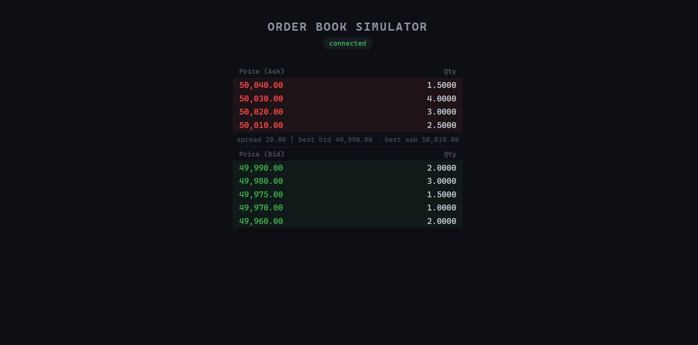

Go-orderbook-simulator is a order book simulator for testing of anomaly detectors.
The service starts a WebSocket server and sends an initial snapshot plus a stream of depthUpdate events from a JSON scenario.

## Run

```bash
go mod tidy
go run . --scenario spoof.json --speed 1.0
```
```bash
# Instant scenario playback
go run . --scenario spoof.json --speed 0

# 2x slower playback
go run . --scenario spoof.json --speed 0.5
```

## Frontend

```bash
cd web
npm install
npm run dev        # opens at http://localhost:5173
```
Keep the backend running in a separate terminal.
